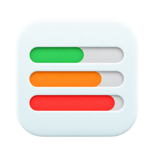
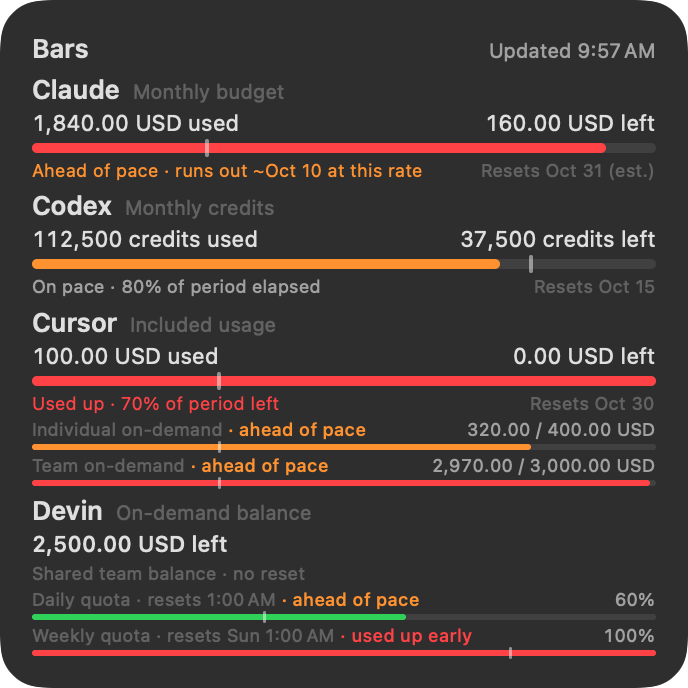
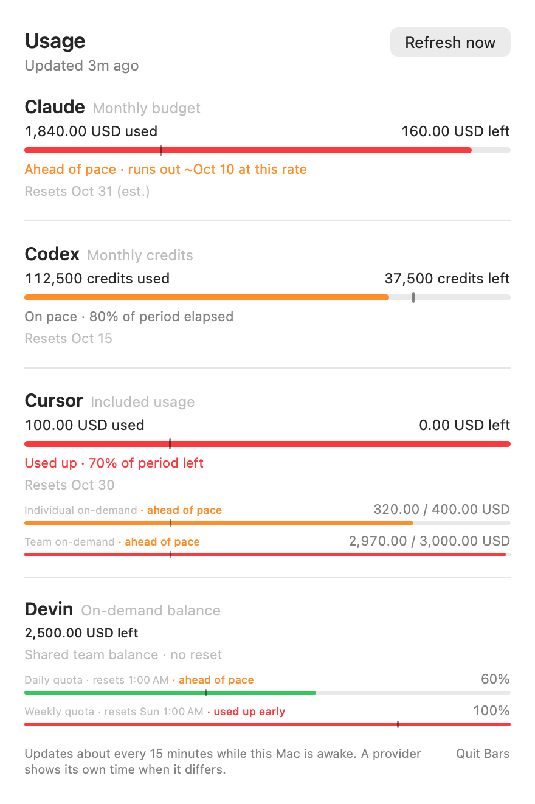

# Bars



Bars puts your Claude, Codex, Cursor and Devin usage in a macOS desktop widget and menu bar dropdown. See what you have used, what remains and whether your usage is on pace until the next reset.

<p>
  
  
</p>

Screenshots use synthetic data.

## What it shows

- **Usage and pace.** Each bar shows usage against an allowance. A tick marks the elapsed share of its period; the pace line estimates whether you will run out before it resets.
- **Your provider's allowances.** Claude and Codex support reported monthly budgets, credits and personal subscription quotas. Cursor keeps individual and team amounts separate. Devin shows its on-demand balance alongside daily and weekly quotas. Support is best effort; not every subscription tier has been verified.
- **Details when you need them.** Click a provider in the widget or dropdown for its allowances, reset times and a manual refresh. Failed refreshes keep the last successful values and show their age.

Bars collects in the background every 15 minutes, even when the menu bar app is closed. WidgetKit controls the desktop widget's redraw timing, so it can lag behind the dropdown.

## Install

You need macOS 14 or later, Apple's Command Line Tools 15 or later, and logins for the providers you use. If the tools are missing, the bootstrap opens Apple's installer and asks you to rerun the command afterwards. Homebrew, full Xcode and a paid Apple Developer membership are not needed.

Use an account that can write to `/Applications`, usually an administrator account. Bars supports one installing account per Mac; updates and uninstalling must use that account. Bars does not run `sudo` or ask for an administrator password.

Paste this into Terminal:

```sh
curl -fsSL https://raw.githubusercontent.com/kenny-linktree/bars/main/scripts/bootstrap.sh -o ~/Downloads/bars-bootstrap.sh && sh ~/Downloads/bars-bootstrap.sh
```

The command downloads the complete script before running it. To inspect it first, run the `curl` part on its own, then the `sh` part.

The installer builds Bars on your Mac, places it in `/Applications`, starts background collection and opens the menu bar app. The build is ad-hoc signed, without Developer ID signing or notarization. See [installation details](docs/distribution.md) for paths, options and signing limitations.

To add the widget, right-click the desktop, choose **Edit Widgets**, search for Bars and add the large widget.

## Privacy and access

Bars reuses your existing provider logins. There is no Bars account, telemetry or server of its own. Usage requests go directly to the providers.

| Provider | Login Bars reads | Usage host |
| --- | --- | --- |
| Claude | `Claude Code-credentials` in the macOS Keychain | `api.anthropic.com` |
| Codex | `~/.codex/auth.json` | `chatgpt.com` |
| Cursor | `cursor-access-token` in the macOS Keychain | `cursor.com` |
| Devin | `~/.local/share/devin/credentials.toml`; organization from `devin cloud drs whoami` | `app.devin.ai` |

The collector does not write, refresh or rotate these logins. Each credential goes only to its provider's fixed usage endpoint over verified HTTPS, with redirects refused. The Devin CLI performs its own organization lookup and may manage its own login.

Keychain access may prompt. Choosing **Always Allow** permits other processes running as your user to read that item through `/usr/bin/security`; choose **Allow** if you want a prompt each time.

Usage snapshots and logs stay under `~/Library/Application Support/Bars`, without credentials, account IDs or raw responses. The widget reads a published snapshot and has no provider credentials. [Security and privacy](SECURITY.md) covers file permissions, proxy behavior and the full trust model.

Bars is independent of the providers. Their usage endpoints are not published APIs and may change without notice.

## Choosing providers

The first install checks for local logins and hides providers without one. You can hide or show providers from the Bars dropdown; hidden providers are not collected. Updates preserve your selection. If a login expires, sign in through the provider's client, then refresh Bars.

For command-line selection, see [provider options](docs/distribution.md#provider-selection).

## Updating

Run the install command again, or use the installed copy:

```sh
sh "$HOME/Library/Application Support/Bars/src/scripts/bootstrap.sh"
```

This fetches the latest `main`, rebuilds and reinstalls. Bars does not update itself. Use a separate checkout for development: updates replace tracked changes in the managed source clone.

## Uninstalling

```sh
sh "$HOME/Library/Application Support/Bars/src/scripts/bootstrap.sh" --uninstall
```

This stops Bars and background collection, unregisters the app and widget, and removes the app, preferences and Bars' data, including the source clone. Provider logins are left alone. Add `--keep-data` to preserve the data and source clone. macOS keeps the widget's sandbox container.

If the installed script is missing, use the install command above with `--uninstall` after the second `bars-bootstrap.sh`. It removes Bars without fetching or building the app.

## Development and contributing

Bars uses a Python standard-library collector and a Swift app and widget. Start with the [development guide](docs/development.md) for build, test and preview commands, or the [design record](docs/design.md) for how it works. Coding agents should read [AGENTS.md](AGENTS.md).

Issues and pull requests are welcome. Discuss behavior changes in an issue first, update the relevant design docs and test with synthetic data. Keep real credentials, account IDs, usage figures and live screenshots out of contributions. Report vulnerabilities privately through [SECURITY.md](SECURITY.md).

For widget delays and refresh problems, see [Troubleshooting](docs/troubleshooting.md).

## License

[MIT](LICENSE)
